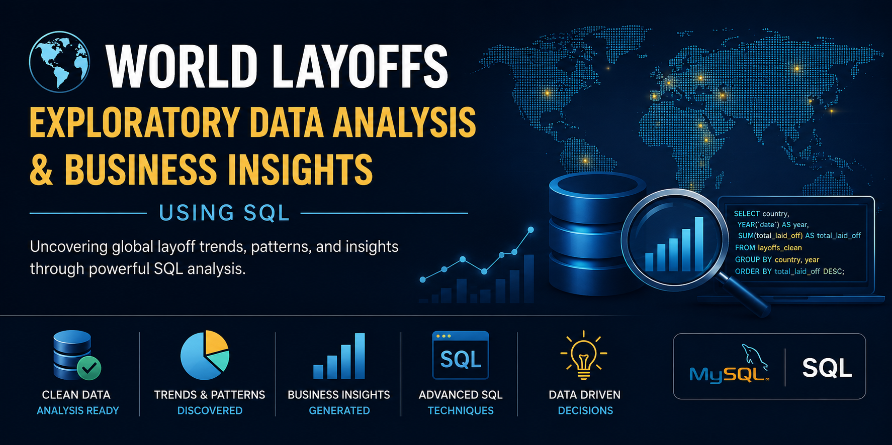
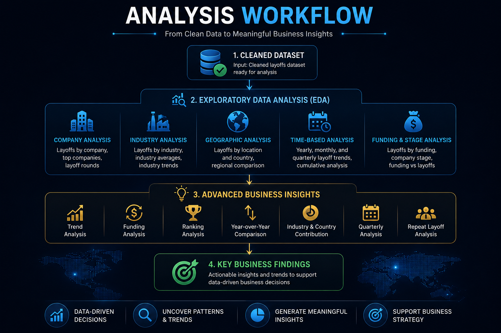
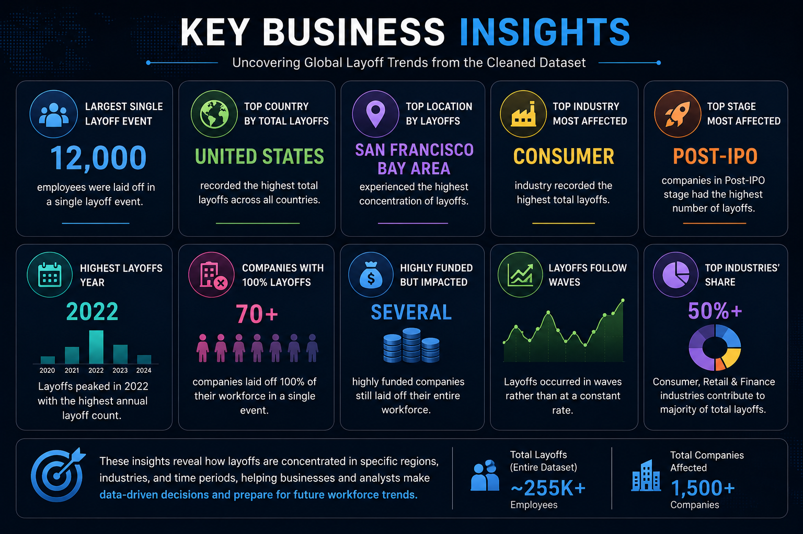

# 🌍 World Layoffs Exploratory Data Analysis & Business Insights using SQL

<p align="center">
  
</p>

<p align="center">


</p>

---

# 📌 Project Overview

This project performs a comprehensive **Exploratory Data Analysis (EDA)** on the cleaned **World Layoffs Dataset** using **MySQL**.

The primary objective is to uncover workforce reduction trends across companies, industries, countries, funding stages, and time periods while answering practical business questions using SQL.

Unlike a traditional EDA project, this repository also includes **15 additional business insight analyses** that extend beyond the original exploratory analysis to demonstrate analytical thinking and advanced SQL techniques.

---

# 📂 Related Project

Before performing the analysis, the dataset was cleaned and standardized in a separate project.

➡️ https://github.com/Subhro27/WORLD_LAYOFFS_DATA_CLEAN_SQL.git

---

# 📊 Project Information

| Item | Details |
|------|---------|
| Author | Subhro Ghosh |
| Database | MySQL 8.0 |
| IDE | MySQL Workbench |
| Dataset | World Layoffs Dataset |
| Project Type | SQL Exploratory Data Analysis |
| Analysis Type | Exploratory + Business Insights |

Dataset Source:

https://www.kaggle.com/datasets/swaptr/layoffs-2022

---

# 🎯 Project Objectives

The primary objectives of this project are:

- Perform Exploratory Data Analysis on the cleaned dataset
- Analyze layoff trends across companies, industries and countries
- Discover temporal trends using yearly and monthly analysis
- Compare layoffs across company stages
- Identify high-impact companies and industries
- Perform advanced business-oriented SQL analysis
- Generate meaningful insights for decision-making

---

# 📊 Analysis Workflow

<p align="center">

</p>

The analysis follows a structured workflow:

- Start with the cleaned dataset
- Perform exploratory data analysis
- Analyze companies, industries, countries and time trends
- Answer business-oriented analytical questions
- Generate actionable business insights

---

# 🔍 Exploratory Data Analysis

The first section focuses on understanding the overall characteristics of the dataset.

The following analyses were performed:

### 📌 Overall Layoff Statistics

- Maximum layoffs
- Layoff percentages
- Companies with 100% layoffs

---

### 🏢 Company Analysis

- Total layoffs by company
- Top companies by year
- Running layoffs

---

### 🌍 Geographic Analysis

- Layoffs by location
- Layoffs by country

---

### 🏭 Industry Analysis

- Layoffs by industry
- Layoffs by company stage

---

### 📅 Time Series Analysis

- Layoffs by year
- Monthly layoffs
- Rolling totals

---

# 💼 Advanced Business Insights

Beyond the standard EDA, an additional **15 business-focused analyses** were performed.

The project answers questions such as:

- Which month recorded the highest layoffs?
- Which companies had the highest average layoffs?
- Which industries experienced the largest layoffs?
- Which companies announced layoffs multiple times?
- Which highly funded companies survived?
- Which industries contributed most to global layoffs?
- How did layoffs change year-over-year?
- Which countries contributed the most layoffs?
- Which quarters experienced the largest layoffs?
- Does higher funding always prevent layoffs?

---

# 📈 SQL Concepts Demonstrated

This project demonstrates practical use of:

### Data Analysis

- SELECT
- WHERE
- GROUP BY
- ORDER BY
- HAVING

### Aggregate Functions

- SUM()
- AVG()
- MAX()
- MIN()
- COUNT()

### Date Functions

- YEAR()
- MONTH()
- QUARTER()
- SUBSTRING()

### Advanced SQL

- CASE Statements
- Common Table Expressions (CTEs)
- Window Functions
- DENSE_RANK()
- LAG()
- SUM() OVER()
- PARTITION BY
- Running Totals
- Subqueries

---

# 📊 Key Business Insights

<p align="center">

</p>

Some important findings from the analysis include:

- 📌 Largest single layoff event affected **12,000 employees**
- 🌍 United States recorded the highest layoffs globally
- 📍 San Francisco Bay Area experienced the highest workforce reductions
- 🏭 Consumer industry recorded the highest layoffs
- 🚀 Post-IPO companies accounted for the largest layoffs
- 📅 Layoffs peaked during **2022**
- 💰 Several highly funded companies still laid off their entire workforce
- 📈 Layoffs occurred in multiple waves rather than at a constant rate

---

# 📁 Repository Structure

```text
WORLD_LAYOFFS_SQL_EDA

│

├── Images
│   ├── project_banner.png
│   ├── analysis_workflow.png
│   └── key_business_insights.png
│
├── Dataset
│   └── layoffs.csv
│
├── SQL Scripts
│   └── 02_World_Layoffs_EDA_and_Business_Insights.sql
│
├── LICENSE
│
└── README.md
```

---

# 🚀 Skills Demonstrated

This project showcases:

- SQL Data Analysis
- Exploratory Data Analysis (EDA)
- Business Intelligence
- Trend Analysis
- Time Series Analysis
- Window Functions
- Ranking Functions
- Business-Oriented SQL
- Analytical Thinking
- Data Storytelling

---

# 🔮 Future Improvements

Potential future enhancements include:

- Build an interactive Power BI dashboard
- Perform statistical analysis using Python
- Develop predictive models for layoff forecasting
- Compare layoffs across multiple economic cycles
- Create interactive dashboards using Tableau

---

# 🙋 About Me

**Subhro Ghosh**

B.Tech Computer Science & Engineering (AI & ML)

Aspiring **Data Analyst** passionate about solving business problems through SQL, Python and data visualization.

---

## ⭐ If you found this project helpful, consider giving it a star!
